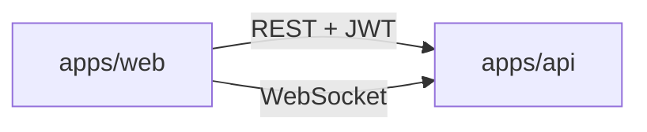
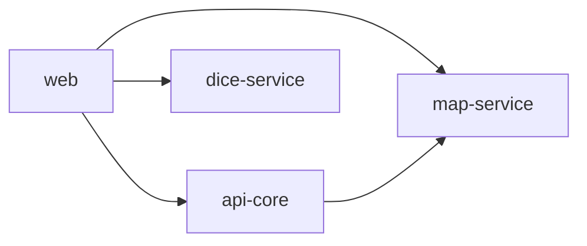
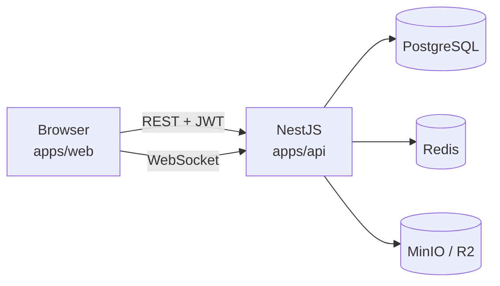

# LoreForge — Monorepo

Visão geral da organização do código. Dois apps deployáveis, **sem pacotes compartilhados** — front e back são unidades independentes, comunicadas apenas por contrato HTTP/WebSocket.

## Documentação

| Arquivo | Conteúdo |
|---------|----------|
| [README.md](README.md) | Visão geral, setup e links |
| [LICENSE.md](LICENSE.md) | Licença proprietária (Guilherme Cezarino Felipe) |
| [LoreForge.md](LoreForge.md) | Requisitos funcionais e stack |
| [plano-mvp.md](plano-mvp.md) | Plano de desenvolvimento, fases e critérios de aceite |
| [apps/web/web.md](apps/web/web.md) | Frontend Next.js |
| [apps/api/api.md](apps/api/api.md) | Backend NestJS |
| [docs/padroes.md](docs/padroes.md) | Padrões de documentação (.md + Swagger) e testes (TDD) |
| [docs/requisitos.md](docs/requisitos.md) | Requisitos funcionais e não funcionais |
| [docs/metricas.md](docs/metricas.md) | Métricas técnicas, produto, SaaS e observabilidade |
| [docs/monetizacao.md](docs/monetizacao.md) | SaaS Free/Premium e setup Google AdSense |
| [docs/loreforge-arquitetura.drawio](docs/loreforge-arquitetura.drawio) | Diagramas draw.io (arquitetura, fluxo, deploy) |

---

## Estrutura

```
LoreForge/
├── apps/
│   ├── web/                 # @loreforge/web — Next.js
│   └── api/                 # @loreforge/api — NestJS
├── docker-compose.yml       # PostgreSQL, Redis, MinIO (dev)
├── README.md
├── LICENSE.md
├── LICENSE
├── LoreForge.md
├── plano-mvp.md
└── monorepo.md
```

Cada app contém **tudo** do seu lado: tipos, schemas, regras de domínio, testes e documentação (`.md` + Swagger na API).

---

## Documentação e testes

Padrão completo: [docs/padroes.md](docs/padroes.md).

| App | Documentação | Testes |
|-----|--------------|--------|
| **api** | Swagger (`@nestjs/swagger`) desde o dia 1 + `<modulo>.md` por módulo | **TDD** — Jest unit, integração, e2e |
| **web** | `<dominio>.md` por área de UI | Vitest + RTL + Cypress + MSW |

Nenhuma feature REST entra sem decorator Swagger. Nenhuma lógica de negócio na API entra sem teste escrito antes (TDD). Métricas: [docs/metricas.md](docs/metricas.md).

## Fronteira entre apps



| Camada | Onde vive | Regra |
|--------|-----------|-------|
| UI, estado de tela, PixiJS, React Flow | `apps/web` | Nunca importa código de `apps/api` |
| Persistência, auth, validação autoritativa, WS gateway | `apps/api` | Nunca importa código de `apps/web` |
| Contrato REST | `apps/api` expõe Swagger (`/api/docs`); `apps/web` consome | OpenAPI desde a Fase 0 |
| Contrato WebSocket | `apps/api/docs/ws-events.md`; web espelha em `src/types/ws-events.ts` | Markdown + Zod |

**Duplicação intencional:** tipos de request/response e eventos WS existem nos dois apps. A API é fonte da verdade; o web espelha para TypeScript. Se divergir, o build/test da integração quebra — preferível a um pacote compartilhado que impede extração.

---

## Responsabilidades

### [apps/web](apps/web/web.md)

Interface: login, campanhas, fichas, docs (TipTap), mapa (PixiJS), dados (UI), quadro (React Flow), modo apresentação.

Inclui internamente:
- Tipos e schemas Zod **de formulário** (validação UX antes do submit)
- Cliente HTTP e hook WebSocket
- Formatação visual de rolagens (a rolagem real vem da API)

### [apps/api](apps/api/api.md)

REST, WebSocket, Drizzle/PostgreSQL, Redis, storage S3/R2.

Inclui internamente:
- DTOs, schemas Zod **autoritativos** (REST + WS)
- Regras Ordem Paranormal: ficha, pool de d20, anti-cheat de rolagem
- RBAC e persistência

---

## Caminho para micro-serviços

Hoje tudo vive em `apps/api`. Quando um domínio crescer o suficiente:



Passos de extração (sem refatoração massiva):

1. Copiar módulo NestJS (ex.: `map/`) para novo app `apps/map-service`
2. Manter os mesmos endpoints/eventos WS — contrato público inalterado
3. `apps/api` vira orquestrador ou some; `apps/web` aponta URL nova via env
4. Nenhum pacote interno para migrar — o módulo já era autocontido

Domínios candidatos a separação futura: **mapa**, **tempo real/WS**, **dados/RPG**, **documentos/storage**.

---

## Fluxo de dados



CRUD → REST (TanStack Query). Sessão ao vivo → WebSocket. Rolagem de ficha → **sempre calculada na API**; web só exibe.

---

## Tooling previsto

| Ferramenta               | Uso                              |
| ------------------------ | -------------------------------- |
| **pnpm workspaces**      | Monorepo com os dois apps        |
| **Turborepo** (opcional) | Build/lint/test paralelo         |
| **TypeScript**           | Strict mode em cada app          |
| **@nestjs/swagger**      | REST documentado desde a Fase 0  |
| **Jest**                 | TDD no backend                   |
| **prom-client**          | Métricas Prometheus (`/metrics`) |
| **pino**                 | Logs JSON estruturados           |
| **Vitest + Cypress**     | Testes no frontend               |
| **Docker Compose**       | PostgreSQL, Redis, MinIO         |

### Scripts raiz (previstos)

```json
{
  "dev": "turbo dev",
  "build": "turbo build",
  "lint": "turbo lint",
  "test": "turbo test",
  "test:e2e": "turbo test:e2e",
  "db:migrate": "pnpm --filter @loreforge/api db:migrate",
  "openapi:export": "pnpm --filter @loreforge/api openapi:export",
  "docker:up": "docker compose up -d"
}
```

---

## Convenções

### Onde colocar código novo

| Se é... | Vai para... |
|---------|-------------|
| Componente, página, hook, store de UI | `apps/web` |
| Endpoint, módulo NestJS, migration, regra de negócio | `apps/api` |
| Tipo usado só no frontend | `apps/web/src/types` |
| DTO/schema autoritativo | `apps/api/src/...` |
| Regra de jogo (Ordem Paranormal) | `apps/api/src/rpg/` (validação) + espelho leve em `apps/web` (formulário) |

### Ordem ao implementar feature que cruza front e back

1. **API (TDD):** teste → endpoint/evento → Swagger + `<modulo>.md`
2. **Web:** tipos/cliente alinhados ao OpenAPI → UI → testes + `<dominio>.md`
3. Verificar checklist em [docs/padroes.md](docs/padroes.md)

---

## Infraestrutura local

```yaml
# docker-compose.yml (previsto)
services:
  postgres:   # DATABASE_URL
  redis:      # REDIS_URL
  minio:      # S3_ENDPOINT (dev)
```

Variáveis de ambiente: [plano-mvp.md](plano-mvp.md#variáveis-de-ambiente-essenciais).

---

## Deploy

| App | Destino |
|-----|---------|
| `@loreforge/web` | Coolify (Next.js) + Cloudflare |
| `@loreforge/api` | Coolify (NestJS) + Cloudflare |
| Storage prod | Cloudflare R2 |
| Banco prod | PostgreSQL gerenciado |

---

## Ordem de implementação

| Fase | web | api |
|------|-----|-----|
| 0 — Fundação | layout, auth UI, Vitest | auth, health, Swagger, **pino** |
| 1 — Campanhas | dashboard, ficha, testes RTL | CRUD TDD, schema OP |
| 2 — Docs | TipTap, MSW mocks | CRUD docs, storage |
| 3 — Realtime | hook WS, ws-client.md | gateway, **métricas WS** |
| 4 — Mapa | PixiJS, testes componente | map module TDD |
| 5 — Dados | log UI, testes | motor d20 TDD |
| 6 — Quadro | React Flow | investigation TDD |
| 7 — Deploy | Cypress, AdSense, **analytics**, Web Vitals | e2e, **`/metrics`**, Grafana |

Detalhes: [plano-mvp.md](plano-mvp.md#checklist-de-fases).

---

## Critérios de aceite do monorepo

- [ ] `pnpm install` resolve apenas `apps/web` e `apps/api`
- [ ] Nenhum import cruzado entre apps (só HTTP/WS)
- [ ] `pnpm dev` sobe web + api com hot reload
- [ ] `docker compose up` sobe PG, Redis e MinIO
- [ ] Regras Ordem Paranormal autoritativas só em `apps/api`
- [ ] Swagger acessível em `/api/docs` desde a Fase 0
- [ ] `/metrics` Prometheus + analytics de produto configurados
- [ ] Todo módulo API com `.md` + testes; web com `.md` + testes por domínio
- [ ] `pnpm test` passa na raiz (api + web)
- [ ] Build de produção gera imagens Docker independentes para web e api
