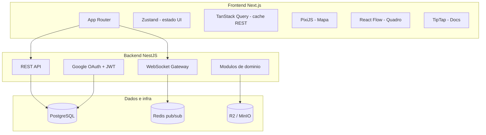
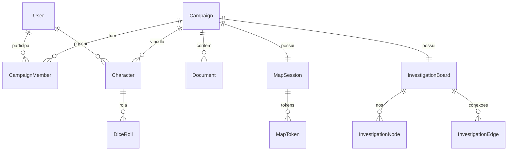
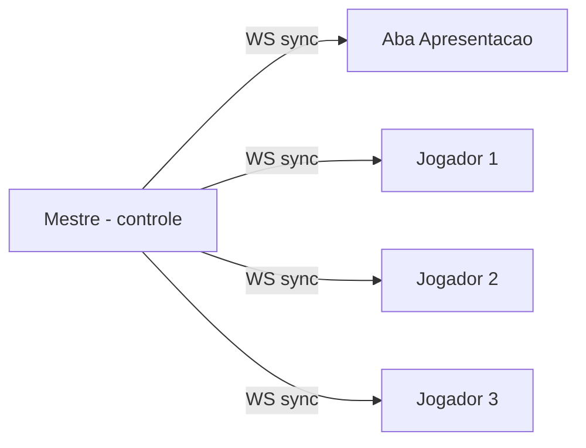
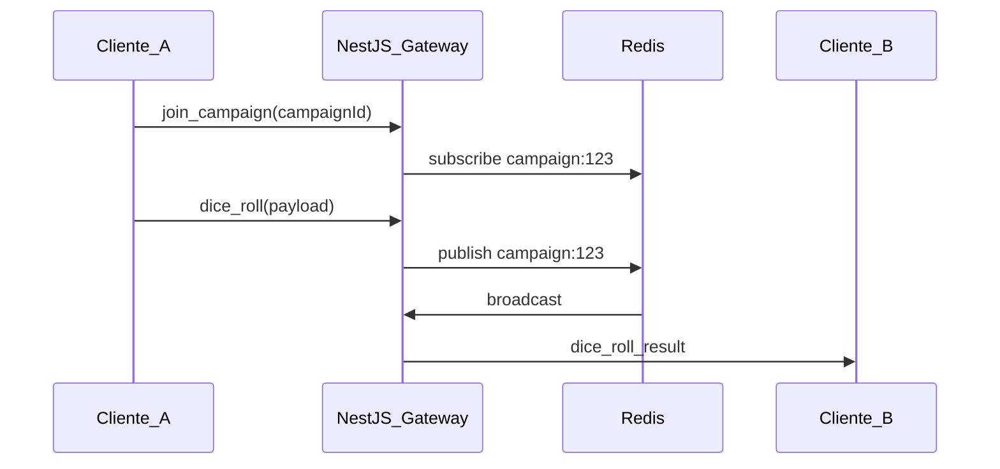

# Plano de Desenvolvimento — MVP LoreForge

Desenvolvimento incremental, sem cronograma fixo. As fases abaixo indicam **ordem sugerida** e **entregáveis** — avance no ritmo que fizer sentido.

## Contexto e escopo

O projeto está em fase **greenfield** ([LoreForge.md](LoreForge.md) é o único artefato existente). O MVP inclui **todas** as funcionalidades listadas no documento (exceto balanceador de homebrew), entregues em versão mínima viável, com **Ordem Paranormal RPG** como sistema inicial.

**Licenciamento:** o LoreForge opera sob a [Licença da Comunidade de Ordem Paranormal v1.0](docs/licenca-ordem-paranormal/LICENCA-COMUNIDADE-v1.0.md) como plataforma VTT comercial. Guia de conformidade: [conformidade-loreforge.md](docs/licenca-ordem-paranormal/conformidade-loreforge.md).

**Referência de mercado:** [C.R.I.S.](https://crisordemparanormal.com/) — fichas, campanhas, rolagens e ferramentas do mestre. O LoreForge se diferencia pelo **mapa tabletop em tempo real**, **modo apresentação para transmissões** e **quadro de investigações integrado** (sem abrir múltiplas janelas).

### Modelo SaaS (Free + Premium)

LoreForge será um **SaaS**. No início, **todas as features do MVP são Free** — sem paywall de funcionalidades.

| Plano | MVP | Anúncios |
|-------|-----|----------|
| **Free** | Todas as features | Google AdSense |
| **Premium** | Igual ao Free | Sem anúncios (único benefício no início) |

Checkout/pagamento Premium fica **pós-MVP**; o app já nasce preparado (`users.plan`, componentes de ad condicionais). Detalhes: [docs/monetizacao.md](docs/monetizacao.md). Métricas: [docs/metricas.md](docs/metricas.md).

### Requisitos mínimos de sessão

- **4 clientes simultâneos** por campanha como piso de aceite (ex.: 1 mestre + 3 jogadores, ou 3 jogadores + 1 tela de apresentação). Sync em tempo real deve permanecer estável nesse cenário.
- **Modo apresentação:** visão dedicada e limpa do mapa — sem sidebars, fichas, log de dados ou controles de edição — aberta em **outra aba** para projeção na mesa, segunda tela ou captura de stream.

---

## Checklist de fases

- [ ] **Fase 0:** Monorepo, Docker, Google OAuth, Drizzle, layout Next.js, **Swagger**, **Jest/Vitest**, **logs + /health**, **selo + disclaimer OP**
- [ ] **Fase 1:** CRUD campanhas/personagens, convites, ficha Ordem Paranormal (schema Zod + UI)
- [ ] **Fase 2:** Documentos TipTap com autosave, permissões GM/jogador e upload R2/MinIO
- [ ] **Fase 3:** WebSocket Gateway NestJS + Redis pub/sub + **métricas WS**
- [ ] **Fase 4:** Tabletop PixiJS — mapa, grid, tokens, fog of war, modo apresentação e sync para 4+ clientes
- [ ] **Fase 5:** Motor de rolagem OP (pool d20), log compartilhado e validação no backend
- [ ] **Fase 6:** Quadro React Flow — nós, conexões, strikethrough e sync debounced
- [ ] **Fase 7:** Testes e2e, CI, deploy, **Google AdSense**, **`/metrics` + analytics**, Grafana, **revisão conformidade licença OP**

---

## Visão de arquitetura



**Monorepo (dois apps autocontidos — ver [monorepo.md](monorepo.md)):**

```
LoreForge/
├── apps/
│   ├── web/          # Next.js — UI, tipos locais, cliente API/WS
│   └── api/          # NestJS — REST, WS, regras OP, persistência
├── docker-compose.yml
└── LoreForge.md
```

Front e back **não compartilham pacotes**. Contrato = HTTP (Swagger) + WebSocket (`.md`). Facilita extração futura em micro-serviços.

Documentação e testes: [docs/padroes.md](docs/padroes.md) — API com **TDD** + Swagger desde o início; web com Vitest/Cypress + `.md` por domínio.

---

## Modelo de domínio (MVP)



### Papéis por campanha

- **Mestre (GM):** CRUD de docs, controle do mapa, visibilidade de tokens, edição do quadro, ativa modo apresentação
- **Jogador:** edita própria ficha, rola dados, move próprio token (se permitido), anota no quadro (conforme permissão)
- **Espectador / Apresentação:** cliente somente leitura do mapa; abre em nova aba pela mesma sessão autenticada; recebe sync de tokens e câmera, sem interação

---

## Modo apresentação (MVP)

Visão fullscreen do mapa para mesa física, segunda tela ou transmissão — basta abrir em **outra aba** do navegador.



**Comportamento MVP:**

- Rota dedicada: `/campaign/[id]/present` (mesma autenticação da sessão; papel `spectator`)
- Botão do mestre: **"Abrir apresentação"** → `window.open` em nova aba
- Canvas PixiJS reutilizado (`TabletopCanvas`), mas **sem chrome de UI** (sem toolbars, painéis, grid toggle, etc.)
- Conteúdo exibido configurável pelo mestre:
  - **Visão do mestre:** mapa completo com fog of war como o GM vê
  - **Mapa revelado:** fog oculto — ideal para audiência
- **Câmera sincronizada:** apresentação segue zoom/pan do mestre (broadcast `map:camera_sync`)
- Tokens visíveis conforme a visão escolhida
- Fundo escuro (#000), proporção responsiva

**Fora do escopo do modo apresentação no MVP:** link público, token de convite, integração OBS, chat overlay, rolagens na tela, quadro de investigações na mesma view.

---

## Ficha Ordem Paranormal (MVP mínimo)

Campos essenciais para primeira versão (schema JSON tipado em `apps/api/src/rpg/`; formulário espelhado em `apps/web`).

**Conformidade com a licença:** usar apenas terminologia geral permitida (Parte 3). Sem templates ou exemplos com nomes do cânone. Sem reprodução de texto oficial dos livros. Ver [conformidade-loreforge.md](docs/licenca-ordem-paranormal/conformidade-loreforge.md).

| Seção | Campos MVP |
|-------|-----------|
| Identidade | nome, origem, classe, trilha, NEX |
| Atributos | Força, Agilidade, Vigor, Intelecto, Presença |
| Recursos | PV, PE, Sanidade (atual/máximo) |
| Perícias | lista com treinada/não treinada + bônus |
| Combate | ataques básicos (nome, dano, bônus) |
| Inventário | itens em texto/lista simples |
| Notas | campo livre |

**Motor de dados MVP** (`apps/api/src/rpg/dice/` — autoritativo; web só exibe resultado):

- Pool de d20: `Xd20` (X = valor do atributo; regra especial para 0 e negativos)
- Crítico (20) e Desastre (1)
- Perícia: melhor dado + bônus vs DT informada pelo mestre
- Rolagens livres (`2d6+3`, etc.) para casos genéricos
- Log de rolagens visível na sessão

---

## Fases de implementação

### Fase 0 — Fundação

**Objetivo:** repositório, infra local, autenticação, **Swagger** e tooling de testes.

**Backend (TDD + Swagger desde o dia 1):**

- NestJS: módulos `health`, `auth`, `users`
- `@nestjs/swagger` configurado em `main.ts` → `/api/docs`
- `@nestjs/terminus`: `GET /health`, `GET /health/ready`
- Logs estruturados (`pino`) + `requestId` por request
- Primeiro teste e2e: `GET /health` (Red → Green)
- Jest: unit + e2e + script `openapi:export`
- Google OAuth → JWT; decorators Swagger em auth
- Drizzle: migrations `users`, `sessions` — campo `users.plan` (`free` \| `premium`, default `free`)
- `health.md`, `auth.md`, `users.md`

**Frontend:**

- Next.js: layout, Tailwind, middleware auth
- TanStack Query + cliente HTTP
- Vitest + RTL configurados
- `api-client.md`, `auth.md`
- **Licença OP:** componente `LicenseBadge`, disclaimer no layout, `legal.md`

**Entregável:** login Google, dashboard vazio, **`/api/docs` funcional**, selo da licença visível, `pnpm test` passando nos dois apps.

---

### Fase 1 — Campanhas e Personagens

**Objetivo:** CRUD completo com convite de jogadores.

**Backend (TDD):**

- Testes antes de cada endpoint CRUD
- Tabelas: `campaigns`, `campaign_members`, `characters`
- Swagger tags `campaigns`, `characters`
- Validação ficha OP + `campaigns.md`, `characters.md`, `rpg.md`

**Frontend:**

- Dashboard, ficha, testes RTL do formulário
- `campaign.md`, `character.md`

**Entregável:** mestre cria campanha, convida jogadores, todos gerenciam fichas.

---

### Fase 2 — Documentos do Mestre

**Objetivo:** docs rich-text criados e visíveis na campanha.

- TipTap integrado no Next.js
- Tabela `documents` (campaign_id, title, content JSON, visibility: gm-only | players)
- Upload de imagens via presigned URL (MinIO dev / R2 prod)
- Autosave debounced (REST) + indicador de status

**Entregável:** mestre cria notas de sessão, handouts e regras de casa; jogadores leem o que for público.

---

### Fase 3 — Infraestrutura em Tempo Real

**Objetivo:** base WebSocket reutilizável por mapa, dados e quadro.



- NestJS `@WebSocketGateway` com rooms por `campaignId`
- Redis pub/sub para escalar horizontalmente (MVP pode usar adapter in-memory local, mas Redis já no compose)
- Eventos WS validados na API (`apps/api/src/gateway/`); tipos espelhados no web:
  - `dice:roll`, `map:token_move`, `map:fog_update`, `map:camera_sync`, `map:presentation_mode`, `board:node_update`, `board:edge_update`, `presence:join/leave`
- Reconexão e sincronização de estado inicial ao entrar na sessão
- Limite soft de **10 conexões** por campanha; testes de aceite com **4 clientes** simultâneos (latência de sync de token < 200 ms em rede local)
- Métricas: `ws_connections_active`, `ws_messages_total`, `ws_broadcast_duration_seconds` — ver [metricas.md](docs/metricas.md)

**Entregável:** quatro clientes na mesma campanha recebem eventos em tempo real sem degradação perceptível.

---

### Fase 4 — Mapa Tabletop

**Objetivo:** mapa interativo sincronizado com PixiJS.

**MVP mínimo:**

- Upload de mapa (imagem) para R2/MinIO
- Grid opcional (quadrado, tamanho configurável)
- Tokens (imagem ou círculo com inicial) vinculados a personagens
- Drag-and-drop de tokens com broadcast de posição
- Zoom e pan (+ sync de câmera para modo apresentação)
- Fog of war básico: retângulos/polígonos ocultos pelo mestre; jogadores veem versão filtrada
- Controle de permissão: mestre move qualquer token; jogador só o próprio
- **Modo apresentação:** rota `/present`, UI limpa, papel `spectator`, botão "Abrir apresentação" em nova aba, toggle visão mestre/revelada

**Persistência:** `map_sessions`, `map_tokens`, `map_fog_zones` (JSON de geometria)

**Frontend:** componente `TabletopCanvas` isolado; variante `TabletopPresentation` (mesmo renderer, layout chrome-free); estado efêmero no Zustand; sync via WS.

**Entregável:** sessão no mapa com **4 clientes** sincronizados (ex.: 1 mestre + 3 jogadores, ou 3 jogadores + 1 aba de apresentação).

---

### Fase 5 — Rolagem de Dados em Tempo Real

**Objetivo:** rolagens da ficha e livres, visíveis para a mesa.

- UI: botões de perícia/atributo na ficha + campo de rolagem livre
- Painel lateral "Log de Rolagens" (últimas N rolagens da sessão)
- Servidor valida rolagens de ficha (anti-cheat básico: recalcula no backend)
- Animação simples no cliente (resultado destacado, crítico/desastre colorido)
- Opcional MVP: mestre define DT; jogador rola contra ela

**Entregável:** clique em "Investigação" rola pool de d20 + bônus; todos veem o resultado.

---

### Fase 6 — Quadro de Investigações

**Objetivo:** anotações conectáveis sem sair da sessão (React Flow).

**MVP mínimo:**

- Nós de texto editáveis (título + corpo)
- Arrastar, redimensionar, conectar com setas
- Estilo "riscado" (strikethrough toggle) para descartar pistas
- Cores/tags simples (pista, NPC, local, teoria)
- Permissões: mestre edita tudo; jogador cria/edita próprios nós (configurável)
- Sync em tempo real via WS (debounce 300ms em edições de texto)
- Export PNG ou JSON (nice-to-have; JSON basta no MVP)

**Persistência:** `investigation_boards`, `investigation_nodes`, `investigation_edges`

**Entregável:** mesa monta mural de investigação durante sessão, todos veem atualizações live.

---

### Fase 7 — Polimento, Deploy e Monetização (Free)

- CI: `lint`, `test`, `test:e2e`, `openapi:export`, `build`
- Cypress: login, CRUD campanha, 4 clientes no mapa, apresentação
- API e2e: auth, CRUD, WS com 4 clientes
- Dockerfiles, Coolify + Cloudflare, README
- Tratamento de erros, loading states, empty states

**Google AdSense (tier Free):**

- Conta AdSense + domínio aprovado; política de privacidade publicada
- **Conformidade licença OP:** produto comercial — sem conteúdo gerado por IA
- `AdProvider` + `AdSlot` em `apps/web` (client components)
- Placements: dashboard, campanha, docs — **nunca** em `/present`
- `useShowAds`: exibe se `plan === 'free'` e `NEXT_PUBLIC_ADS_ENABLED`
- Env: `NEXT_PUBLIC_GOOGLE_ADS_CLIENT`
- Testes: ads não renderizam em premium, apresentação ou dev com ads off

**Stub Premium:**

- `GET /users/me` retorna `{ plan }`; todos `free` no lançamento
- Pagamento/checkout documentado em [monetizacao.md](docs/monetizacao.md) como pós-MVP

**Métricas e observabilidade:**

- `GET /metrics` (Prometheus) — HTTP + WS counters/histograms
- Grafana no Coolify (dashboards latência, conexões, erros)
- Plausible ou PostHog no web — eventos de produto (campanha, mapa, dados, ads)
- Core Web Vitals (`web-vitals`) nas rotas PixiJS/React Flow
- Alertas: health down, 5xx, p95 latência, spike reconexões WS
- Doc: [metricas.md](docs/metricas.md)

**Conformidade licença Ordem Paranormal:**

- Selo oficial visível em produção (≥ 10% largura)
- Disclaimer de não oficialidade em footer e `/legal`
- Revisão de copy/marketing (sem sugestão de parceria oficial)
- Checklist: [conformidade-loreforge.md](docs/licenca-ordem-paranormal/conformidade-loreforge.md#6-checklist-de-conformidade-pré-lançamento)

**Entregável:** MVP deployável, Free com ads, observável, documentado, em conformidade com a licença OP e testado.

---

## Stack por feature (conforme [LoreForge.md](LoreForge.md))

| Feature | Tecnologia |
|---------|------------|
| Auth | Google OAuth, JWT, Swagger tag `auth` |
| CRUD | NestJS REST TDD, Drizzle, TanStack Query |
| Docs API | `@nestjs/swagger` + `<modulo>.md` |
| Docs WS | `apps/api/docs/ws-events.md` |
| Testes API | Jest TDD (unit, integração, e2e) |
| Testes Web | Vitest, RTL, MSW, Cypress |
| Mapa | PixiJS + WebSocket |
| Dados | `apps/api/src/rpg/dice` + WebSocket + log persistido |
| Docs | TipTap + R2/MinIO |
| Quadro | React Flow + WebSocket |
| Estado UI | Zustand |
| Tempo real | NestJS WS + Redis |
| Monetização Free | Google AdSense (`apps/web`) |
| Plano usuário | `users.plan` free \| premium (API) |
| Métricas | Prometheus `/metrics`, Grafana, Plausible/PostHog |

---

## Variáveis de ambiente essenciais

```env
# Auth
GOOGLE_CLIENT_ID=
GOOGLE_CLIENT_SECRET=
JWT_SECRET=

# DB
DATABASE_URL=postgresql://...
REDIS_URL=redis://...

# Storage
S3_ENDPOINT=          # MinIO local / R2 prod
S3_BUCKET=
S3_ACCESS_KEY=
S3_SECRET_KEY=

# App
NEXT_PUBLIC_API_URL=
NEXT_PUBLIC_WS_URL=

# Ads (apps/web — tier Free)
NEXT_PUBLIC_GOOGLE_ADS_CLIENT=ca-pub-XXXXXXXXXX
NEXT_PUBLIC_ADS_ENABLED=false   # true em prod; false em dev local

# Métricas
LOG_LEVEL=info
METRICS_ENABLED=true
NEXT_PUBLIC_ANALYTICS_ENABLED=false   # true em prod
NEXT_PUBLIC_PLAUSIBLE_DOMAIN=loreforge.example.com
```

---

## Riscos e mitigações

| Risco | Mitigação |
|-------|-----------|
| PixiJS + React lifecycle complexo | Canvas isolado; unmount limpo; POC inicial antes de integrar na Fase 4 |
| Sync conflict no quadro/mapa | Last-write-wins no MVP; version field por entidade |
| Escopo de ficha OP muito grande | MVP cobre 80% da sessão; rituais/poderes como texto livre inicialmente |
| WebSocket instável | Fallback polling a cada 5s para log de dados; reconexão automática |
| 4+ clientes degradam sync do mapa | Throttle de `camera_sync` (max 10/s); delta updates de posição de token; teste de carga na Fase 7 |
| Direitos IP Ordem Paranormal | [Licença da Comunidade v1.0](docs/licenca-ordem-paranormal/conformidade-loreforge.md); selo + disclaimer; sem marca/arte oficial; sem IA comercial |

---

## Fora do MVP (backlog imediato pós-lançamento)

- **Premium checkout** — pagamento para remover anúncios (Stripe ou similar)
- Balanceador de homebrew (armas, poderes) — já marcado como futuro no doc
- Sistema genérico / import de outros RPGs
- Audio/video integrado
- Modo offline
- App mobile nativo

---

## Critérios de aceite do MVP

1. Login Google funcional
2. Mestre cria campanha e convida jogadores
3. Jogadores criam/editam ficha Ordem Paranormal
4. Mestre cria docs rich-text visíveis na campanha
5. Mapa com tokens sincronizados entre **4 clientes** simultâneos na mesma sessão
6. **Modo apresentação** com UI limpa, aberta em nova aba, câmera sincronizada e papel espectador
7. Rolagem de perícia/atributo OP com log compartilhado
8. Quadro de investigações editável em tempo real com conexões e riscado
9. Deploy local via Docker e deploy prod via Coolify documentado
10. Swagger em `/api/docs` e `.md` por módulo/domínio atualizados
11. `pnpm test` passando em api e web; e2e cobrindo fluxos críticos
12. Google AdSense configurado no tier Free; ads ocultos em `/present` e quando `plan === 'premium'`
13. `/metrics` Prometheus, analytics de produto e dashboards operacionais configurados
14. Selo da Licença da Comunidade de Ordem Paranormal visível; disclaimer de não oficialidade; conformidade documentada
